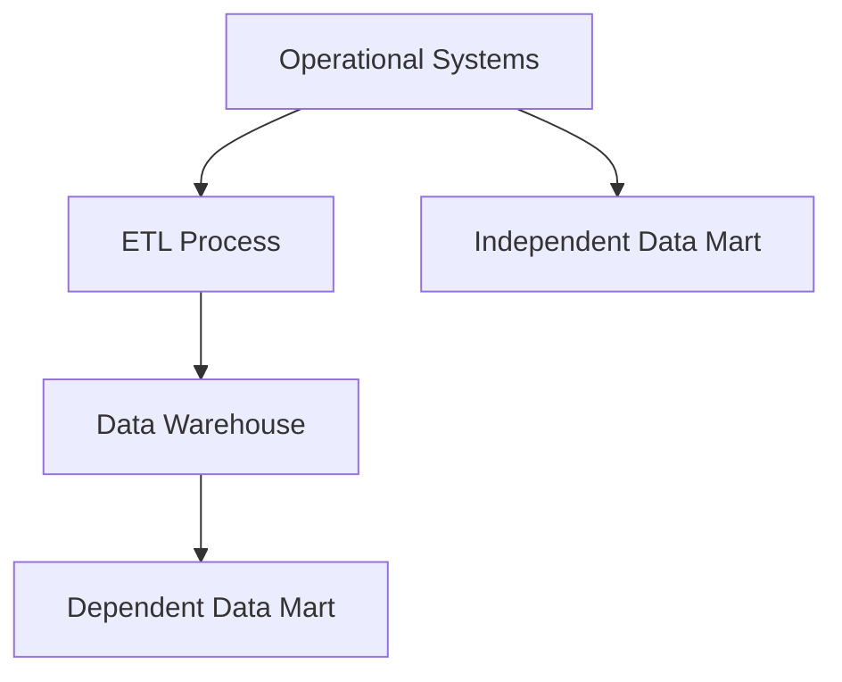

## **Data Mart**

---

### **1. What is a Data Mart?**

A **data mart** is a **subset of a data warehouse** focused on a **specific business line, function, or department** (e.g., sales, finance, HR). It stores **domain-specific data** to support faster and simpler access for analysis.

---

### **2. Key Features**

* Focused on **one subject area** or business function
* **Smaller** in size and scope compared to a data warehouse
* Can be **dependent**, **independent**, or **hybrid**
* Enables **faster query performance**
* Designed for **specific user groups**

---

### **3. Types of Data Marts**

| Type            | Description                                                          | Source                         |
| --------------- | -------------------------------------------------------------------- | ------------------------------ |
| **Dependent**   | Sourced from a central enterprise data warehouse                     | Data warehouse                 |
| **Independent** | Sourced directly from operational or external systems                | Operational databases          |
| **Hybrid**      | Combines data from both the central data warehouse and other sources | Data warehouse + other systems |

---

### **4. Comparison: Data Mart vs Data Warehouse**

| Feature             | Data Mart                         | Data Warehouse             |
| ------------------- | --------------------------------- | -------------------------- |
| Scope               | Department-specific               | Enterprise-wide            |
| Size                | Smaller                           | Large                      |
| Users               | Business analysts of a department | Entire organization        |
| Design              | Simple (star/snowflake)           | Complex (multiple schemas) |
| Implementation Time | Faster                            | Longer                     |
| Maintenance         | Easier                            | More complex               |

---

### **5. Use Cases**

* Sales performance reporting
* Customer segmentation analysis
* Financial budgeting and forecasting
* HR employee metrics
* Marketing campaign analysis

---

### **6. Architecture of Data Mart Deployment**

---

### **7. Benefits**

* Improves **performance** for department-level queries
* Enhances **data access** for specific teams
* Enables **faster development** and deployment
* Simplifies **data governance** within a domain
* Supports **agile analytics**

---

### **8. Challenges**

* **Data silos** if not properly integrated
* **Redundancy** and **inconsistency** in independent marts
* Difficult to **maintain consistency** across multiple marts
* Scalability issues if poorly designed

---

### **9. Tools for Data Mart Implementation**

| Category        | Tools                                 |
| --------------- | ------------------------------------- |
| ETL Tools       | Informatica, Talend, SSIS, dbt        |
| Databases       | Snowflake, Redshift, Oracle, BigQuery |
| Reporting Tools | Power BI, Tableau, Looker             |

---
