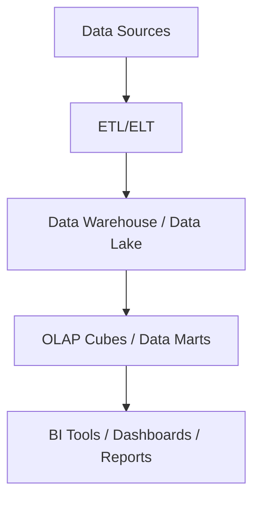

## **Business Intelligence (BI) – Comprehensive Overview**

---

### **1. What is Business Intelligence?**

Business Intelligence (BI) refers to the **technologies, processes, and tools** used to **collect, integrate, analyze, and present** business data, enabling informed decision-making.

---

### **2. Key Objectives**

* Transform raw data into **meaningful insights**
* Support **strategic, tactical, and operational decisions**
* Enable **data-driven culture** across the organization
* Provide **real-time and historical analysis**

---

### **3. Core Components**

| Component         | Description                                                |
| ----------------- | ---------------------------------------------------------- |
| **Data Sources**  | Databases, data warehouses, data marts, external APIs      |
| **ETL Processes** | Extract, transform, and load data for BI analysis          |
| **Data Storage**  | Data warehouses, data lakes, OLAP cubes                    |
| **BI Tools**      | Dashboards, reporting tools, data visualization            |
| **Users**         | Business analysts, managers, executives, operational staff |

---

### **4. Common BI Activities**

* **Reporting:** Scheduled or ad-hoc reports with key metrics
* **Data Visualization:** Charts, graphs, heatmaps for quick understanding
* **Dashboards:** Interactive panels to monitor KPIs in real-time
* **OLAP Analysis:** Multidimensional data exploration and slicing
* **Data Mining:** Discover patterns, correlations, and trends
* **Predictive Analytics:** Forecast future trends based on historical data

---

### **5. Types of BI Systems**

| Type                | Description                                              |
| ------------------- | -------------------------------------------------------- |
| **Operational BI**  | Real-time monitoring and alerts                          |
| **Strategic BI**    | Long-term trend analysis and planning                    |
| **Tactical BI**     | Mid-term performance and efficiency tracking             |
| **Self-Service BI** | Enables end-users to create their own reports without IT |

---

### **6. Popular BI Tools**

| Tool                    | Key Features                                 |
| ----------------------- | -------------------------------------------- |
| **Tableau**             | Interactive dashboards, drag-and-drop        |
| **Power BI**            | Microsoft integration, easy data prep        |
| **Looker**              | Data modeling layer, SQL-based analysis      |
| **Qlik Sense**          | Associative data model, in-memory processing |
| **SAP BusinessObjects** | Enterprise reporting and analysis            |
| **Google Data Studio**  | Free, integrates with Google ecosystem       |

---

### **7. BI Architecture Layers**

---

### **8. Benefits**

* Faster, accurate decision-making
* Enhanced business performance visibility
* Data democratization across teams
* Identification of new business opportunities
* Competitive advantage through analytics

---

### **9. Challenges**

* Data quality and consistency issues
* Complex integration across multiple data sources
* User adoption and training
* Keeping reports and dashboards updated
* Ensuring data security and governance

---
