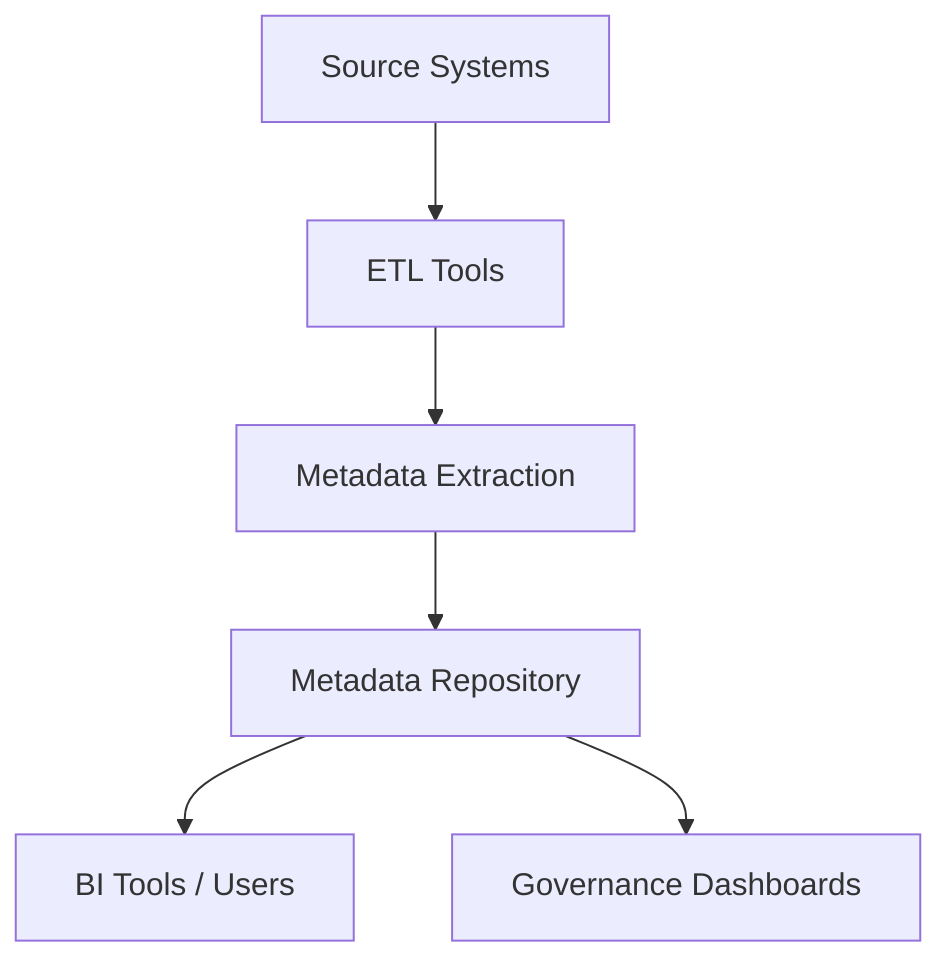

## 📘 Metadata Repository in Data Warehousing

---

### **Definition**

A **Metadata Repository** is a centralized **storage system** that stores, manages, and retrieves all types of **metadata** related to the data warehouse, including technical, business, operational, and process metadata.

---

### **Purpose**

- Acts as the **central knowledge base** for understanding the structure, behavior, and semantics of data  
- Supports **data governance**, **lineage tracking**, **impact analysis**, and **self-service BI**  
- Facilitates **communication** between technical and business users  
- Enables **automation** of ETL, data quality, and reporting workflows

---

### **Core Functions**

| **Function**                    | **Description** |
|----------------------------------|-----------------|
| **Storage of Metadata**          | Stores metadata collected from ETL tools, DBMS, BI tools, and source systems |
| **Search and Retrieval**         | Allows querying and retrieving metadata through GUI or API |
| **Versioning and Change Tracking** | Maintains history of schema/logic changes, important for auditing and rollback |
| **Data Lineage Tracking**        | Tracks the flow of data from source to final reporting |
| **Impact Analysis**              | Analyzes the effect of changes (e.g., deleting a column) across systems |
| **Governance & Compliance**      | Helps enforce policies, ownership, classification, and security of data |

---

### **Types of Metadata Stored**

- **Technical** (schemas, types, indexes)
- **Business** (definitions, KPIs, policies)
- **Operational** (ETL logs, job statuses)
- **Lineage** (source-to-target flow)
- **Audit/Usage** (who accessed what and when)

---

### **Architecture**

---

### **Common Metadata Repository Tools**

| **Tool**            | **Vendor / Platform** |
|---------------------|------------------------|
| Apache Atlas        | Open-source (Big Data) |
| Informatica MDM     | Informatica            |
| Talend MDM          | Talend                 |
| Alation              | Alation Inc.           |
| Collibra             | Collibra               |
| Microsoft Purview    | Microsoft Azure        |
| AWS Glue Data Catalog | AWS                   |
| Google Data Catalog  | GCP                    |

---

### **Best Practices**

- Regularly **synchronize** metadata from all systems  
- Provide **access control** and **audit logging**  
- Keep metadata **standardized** using naming conventions  
- Make metadata **easily searchable** by technical and business users  
- Use metadata for **automating ETL**, **data validation**, and **report generation**

---
