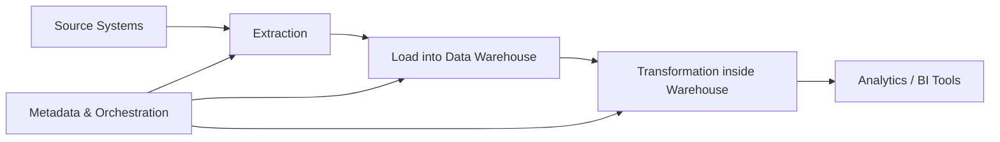

## **ELT (Extract, Load, Transform)**

---

### **1. What is ELT?**

ELT is a data integration process where data is first **Extracted** from sources, then **Loaded** into a target system (usually a data lake or modern data warehouse), and finally **Transformed** **within** the target system.

---

### **2. ELT vs ETL**

| Aspect                  | ETL                                              | ELT                                                           |
| ----------------------- | ------------------------------------------------ | ------------------------------------------------------------- |
| Process Order           | Extract → Transform → Load                       | Extract → Load → Transform                                    |
| Transformation Location | On separate ETL server or tool                   | Inside target data warehouse or lake                          |
| Suitable For            | Traditional DWs with limited storage and compute | Modern cloud data warehouses with strong compute power        |
| Data Volume Handling    | Usually for moderate volumes                     | Scales well for very large data volumes                       |
| Processing Speed        | Transformation can be slower (external tool)     | Faster transformations leveraging warehouse compute           |
| Flexibility             | Less flexible for ad hoc analysis                | More flexible; transformations can be re-run inside warehouse |
| Tool Complexity         | Requires dedicated ETL tools                     | Can use SQL or built-in warehouse features                    |

---

### **3. ELT Architecture Components**

* **Source Systems**: Databases, applications, APIs from where data is extracted.
* **Extraction Layer**: Extracts raw data without transformation.
* **Loading Layer**: Loads raw data directly into the target system (data lake or data warehouse).
* **Transformation Layer**: Performs data transformation inside the target system using SQL or processing frameworks.
* **Target System**: Modern data warehouse (e.g., Snowflake, BigQuery, Redshift) or data lake (e.g., S3 with processing engines).
* **Metadata & Control Layer**: Manages workflow orchestration, monitoring, and logging.

---

### **4. Advantages of ELT**

* **Scalability**: Leverages cloud or powerful warehouse compute to handle big data.
* **Performance**: Transforms data using distributed processing capabilities of the warehouse.
* **Flexibility**: Analysts can run different transformations and queries directly on raw data.
* **Simplicity**: Eliminates need for a separate transformation engine.
* **Cost-Effective**: Reduces data movement, uses warehouse storage and compute efficiently.

---

### **5. Challenges of ELT**

* Requires a **robust, scalable target platform** with strong compute.
* Raw data in warehouse might require **data governance** and careful management.
* Transformation logic can become complex inside the warehouse.
* Not always suitable for **real-time** or low-latency use cases.

---

### **6. When to Use ELT?**

* When using **cloud-native data warehouses** with strong processing power.
* When data volumes are **very large** and transforming before loading is inefficient.
* When you want to keep **raw data** available for flexible or ad hoc analysis.
* When you want to **simplify ETL pipelines** by offloading transformation.

---

### **7. Typical ELT Data Flow**

---

### **8. Summary**

| Feature             | Description                                   |
| ------------------- | --------------------------------------------- |
| Approach            | Extract → Load → Transform inside warehouse   |
| Best for            | Cloud data warehouses, big data scenarios     |
| Advantages          | Scalable, flexible, cost-efficient            |
| Challenges          | Requires strong warehouse compute, governance |
| Tools commonly used | Snowflake, BigQuery, Redshift, Databricks     |

---
