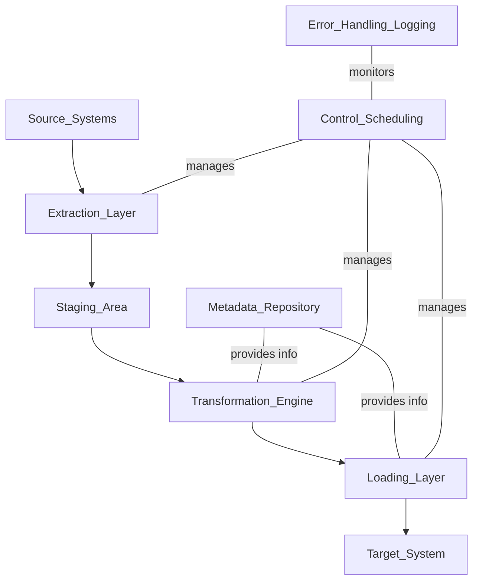

## **ETL Architecture Components**

---

### **1. Overview**

ETL architecture consists of integrated components that work together to **extract**, **transform**, and **load** data from sources into the target data warehouse or repository.

---

### **2. Core Components of ETL Architecture**

| Component                          | Description                                                                                                                |
| ---------------------------------- | -------------------------------------------------------------------------------------------------------------------------- |
| **Source Systems**                 | Original systems where data resides, such as databases, files, APIs, cloud storage, or legacy systems.                     |
| **Extraction Layer**               | Mechanism or tools to connect to sources and extract data efficiently with minimal impact.                                 |
| **Staging Area**                   | Temporary storage area where raw extracted data is held before transformation; often on a separate server or schema.       |
| **Transformation Engine**          | Processes and converts raw data into required formats; applies business rules, cleansing, aggregation, and validations.    |
| **Loading Layer**                  | Component that inserts or updates the transformed data into the target system (data warehouse/data mart).                  |
| **Metadata Repository**            | Stores metadata such as data mappings, transformation rules, schedules, and audit information for tracking and management. |
| **ETL Control and Scheduling**     | Manages ETL workflow execution, scheduling, dependencies, and error handling, ensuring jobs run in the correct order.      |
| **Error Handling & Logging**       | Captures errors, warnings, and process logs during ETL execution for debugging, auditing, and monitoring.                  |
| **Data Warehouse / Target System** | Final destination for the transformed data where it is stored for analysis and reporting.                                  |

---

### **3. Detailed Description of Components**

| Component                    | Role and Function                                                                                   |
| ---------------------------- | --------------------------------------------------------------------------------------------------- |
| **Source Systems**           | Can be transactional databases (OLTP), CRM, ERP, flat files, cloud apps, or third-party data.       |
| **Extraction Layer**         | Connectors, APIs, or adapters to access source data. Can support full or incremental extraction.    |
| **Staging Area**             | Acts as a buffer, isolates source systems from transformation workload, allows data validation.     |
| **Transformation Engine**    | Applies cleansing, filtering, integration, aggregation, business rules, and key generation.         |
| **Loading Layer**            | Performs bulk or incremental data loading, handles indexing, and maintains data integrity.          |
| **Metadata Repository**      | Contains technical and business metadata: data lineage, transformation rules, schedules.            |
| **Control & Scheduling**     | Orchestrates ETL jobs, manages dependencies, retries on failure, sends alerts.                      |
| **Error Handling & Logging** | Tracks ETL process status, logs failures, captures rejected data for reprocessing.                  |
| **Target System**            | Usually a relational data warehouse, columnar store, or data lake optimized for query and analysis. |

---

### **4. ETL Workflow Overview**

---

### **5. Additional Components**

| Component              | Description                                                            |
| ---------------------- | ---------------------------------------------------------------------- |
| **Data Quality Tools** | Validate and enhance data accuracy and completeness                    |
| **Security Layer**     | Implements access control, encryption, and compliance measures         |
| **Audit Trail**        | Maintains history of ETL runs and changes for compliance and debugging |

---

### **6. Summary**

ETL architecture is a **layered framework** designed to **seamlessly integrate, transform, and deliver data** from disparate sources to the target repository, ensuring data quality, reliability, and efficient processing.

---
