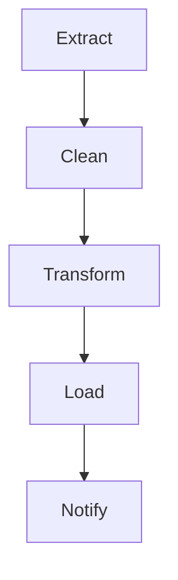

## **Orchestration and Scheduling in ETL/ELT**

**Orchestration** is the process of managing and coordinating various tasks and data flows in an ETL/ELT pipeline. **Scheduling** determines when and how frequently those tasks run. Together, they ensure automated, reliable, and orderly data processing.

---

## **Goals**

* Automate workflows (no manual triggers)
* Ensure correct task execution order
* Handle dependencies and failures
* Enable parallelism and scalability
* Optimize resource usage and performance

---

## **Components of Orchestration**

| Component             | Description                                           |
| --------------------- | ----------------------------------------------------- |
| **Tasks/Jobs**        | Individual operations like extract, transform, load   |
| **Dependencies**      | Rules that define execution order between tasks       |
| **Triggers**          | Conditions or events that start the workflow          |
| **Retries & Alerts**  | Mechanisms to handle failures and notify stakeholders |
| **Logs & Monitoring** | Track executions and detect issues                    |

---

## **Types of Scheduling**

| Type                  | Description                                          |
| --------------------- | ---------------------------------------------------- |
| **Time-based (cron)** | Scheduled at specific intervals (e.g., daily at 2AM) |
| **Event-based**       | Triggered by events like file arrival or API signal  |
| **Dependency-based**  | Triggered when upstream job completes                |
| **Manual**            | Triggered on-demand                                  |

---

## **Popular Orchestration Tools**

| Tool                      | Key Features                                            |
| ------------------------- | ------------------------------------------------------- |
| **Apache Airflow**        | DAG-based, Python configurable, rich UI                 |
| **Prefect**               | Python-native, supports cloud/local runs, observability |
| **Dagster**               | Strong type checks, software-defined assets             |
| **Luigi**                 | Python-based, handles dependencies well                 |
| **AWS Step Functions**    | Serverless orchestration in AWS                         |
| **Azure Data Factory**    | GUI-based pipelines, integrates with Azure services     |
| **Google Cloud Composer** | Managed Airflow service in GCP                          |

---

## **Workflow Design with DAGs**

* DAG = Directed Acyclic Graph
* Represents tasks and their dependencies
* Ensures no cyclic dependency (no infinite loops)
* Tasks run in topological order

---

## **Key Concepts in Scheduling**

| Concept                             | Explanation                                  |
| ----------------------------------- | -------------------------------------------- |
| **Cron Expression**                 | `0 2 * * *` → Runs every day at 2:00 AM      |
| **Backfill**                        | Re-running pipelines for past dates          |
| **Catch-up**                        | Automatically executing missed schedules     |
| **Concurrency**                     | Number of workflows that can run in parallel |
| **SLAs (Service Level Agreements)** | Define execution time expectations           |

---

## **Monitoring and Alerts**

* Email, Slack, PagerDuty notifications
* Logs and dashboards for run history
* Retry policies with exponential backoff
* Custom alerting for data quality issues

---

## **Best Practices**

* Use idempotent tasks (safe to rerun)
* Split complex pipelines into modular workflows
* Add logging and error handling to every step
* Use parameterization for reusable workflows
* Document task dependencies and schedule

---

## **Example DAG Flow**

---
