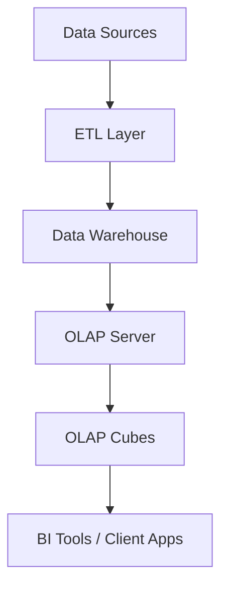

## **OLAP Architecture**

---

### **What is OLAP Architecture?**

OLAP architecture defines how data is collected, stored, organized, and accessed in **OLAP systems** for fast and interactive **multidimensional analysis**. It involves components like **data sources**, **ETL processes**, **data warehouses**, and **OLAP servers**.

---

### **Layers of OLAP Architecture**

#### **1. Data Source Layer**

* **Origin**: OLTP databases, CRM, ERP, spreadsheets
* **Role**: Provide raw operational data for analysis

#### **2. ETL Layer**

* **Extract**: Pull data from various sources
* **Transform**: Clean, format, and apply business logic
* **Load**: Store data in a data warehouse in a structured form

#### **3. Data Warehouse Layer**

* **Central Repository** for integrated, historical, and subject-oriented data
* Optimized for **read-heavy** and **analytical** workloads

#### **4. OLAP Server Layer**

* Core engine that manages **OLAP cubes** and handles **query execution**
* Types:

  * **MOLAP**: Uses multidimensional databases
  * **ROLAP**: Uses relational databases
  * **HOLAP**: Combines both
* Pre-computes **aggregates and summaries** for fast querying

#### **5. Front-End / Client Layer**

* Business Intelligence tools (e.g., Power BI, Tableau)
* Provides visualization, dashboards, and OLAP operations (slice, dice, etc.)
* Used by analysts and business users

---

### **OLAP Architecture Diagram (Mermaid)**

---

### **Types of OLAP Architectures**

| Type      | Description                                                                 |
| --------- | --------------------------------------------------------------------------- |
| **MOLAP** | Multidimensional DB stores pre-aggregated cubes for fast access             |
| **ROLAP** | Relational DB stores detailed data; queries computed using SQL              |
| **HOLAP** | Combines MOLAP (summary) and ROLAP (detail) for flexibility and performance |

---

### **Key Components Explained**

| Component            | Description                                         |
| -------------------- | --------------------------------------------------- |
| **Fact Tables**      | Store numeric data (measures)                       |
| **Dimension Tables** | Store categorical data (perspectives)               |
| **Cubes**            | Multidimensional view with pre-aggregated data      |
| **Metadata**         | Defines cube structure, dimensions, hierarchies     |
| **OLAP Engine**      | Handles calculations, cube generation, user queries |

---

### **Advantages of OLAP Architecture**

* Supports **fast, multidimensional queries**
* Enables **scalable** and **interactive** analytics
* Centralized architecture ensures **data consistency**
* Supports **time-based analysis**, drill-down, and ad hoc reporting

---

### **Challenges**

* High **storage cost** (MOLAP)
* **Complexity** in cube design
* Requires **periodic updates** (ETL refresh)
* Performance tuning for large datasets

---
