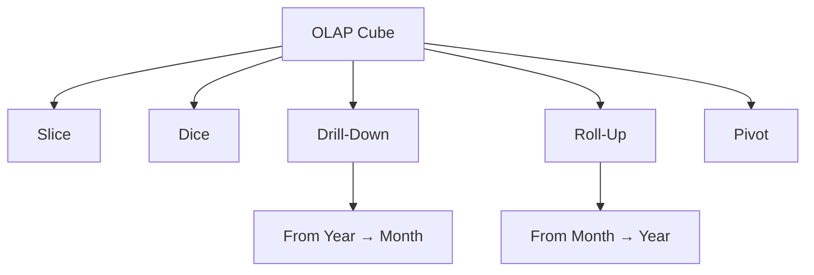

## **OLAP Operations**

---

### **What Are OLAP Operations?**

OLAP operations allow users to explore multidimensional data stored in OLAP cubes by **navigating**, **filtering**, and **restructuring** it for better insight. These operations are performed on **dimensions**, **hierarchies**, and **measures** of a cube.

---

### **Core OLAP Operations**

| Operation          | Description                                                              |
| ------------------ | ------------------------------------------------------------------------ |
| **Slice**          | Selects a single value for one dimension, reducing cube dimensionality   |
| **Dice**           | Selects a sub-cube by specifying multiple values for multiple dimensions |
| **Drill-Down**     | Navigates from higher-level summary data to lower-level detailed data    |
| **Roll-Up**        | Aggregates detailed data to a higher-level summary in a hierarchy        |
| **Pivot (Rotate)** | Reorients the cube to provide an alternate presentation of data          |

---

### **1. Slice**

* **Definition**: Filters the cube on **one dimension** to view data for a specific value.
* **Example**: Slice the cube on `Year = 2024`.
* **Result**: Reduces a 3D cube (Time, Product, Region) to a 2D plane (Product × Region for 2024).

---

### **2. Dice**

* **Definition**: Filters the cube using **multiple dimensions** or multiple values within dimensions.
* **Example**: Dice where `Year = 2024`, `Region IN (East, West)`, `Product IN (A, B)`.
* **Result**: Smaller sub-cube containing only selected data.

---

### **3. Drill-Down**

* **Definition**: Moves from **summary** data to **detailed** data.
* **Example**: From `Year → Quarter → Month`.
* **Use**: Helps analyze underlying causes or patterns.

---

### **4. Roll-Up**

* **Definition**: Aggregates data **upward** in a hierarchy (opposite of drill-down).
* **Example**: From `Month → Quarter → Year`.
* **Use**: Useful for summarizing data for reporting.

---

### **5. Pivot (Rotate)**

* **Definition**: Changes the dimensional orientation of the report.
* **Example**: Swap rows and columns — change from `Product vs Region` to `Region vs Product`.
* **Use**: Offers different perspectives of the same data.

---

### **Additional OLAP Operations (Advanced)**

| Operation         | Description                                                          |
| ----------------- | -------------------------------------------------------------------- |
| **Drill-Across**  | Analyzes data from different fact tables that share dimensions       |
| **Drill-Through** | Goes from summary in OLAP to **detailed transactional data** in OLTP |
| **Ranking**       | Sorts or ranks dimensions based on measures                          |
| **Filtering**     | Applies conditions to exclude specific records or dimensions         |

---

### **Visual Overview (Mermaid)**

---
