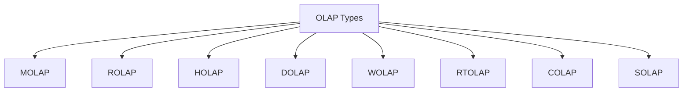

## **OLAP Types**

### **What is OLAP?**

**OLAP (Online Analytical Processing)** is a category of software that allows users to analyze large volumes of data interactively from multiple perspectives using multidimensional structures called **OLAP cubes**.

---

#### **Purpose of OLAP Types**

Different OLAP types exist to balance between **performance**, **scalability**, **storage**, **cost**, and **usability** across various data analysis use cases.

---

### **OLAP Types**

| OLAP Type  | Full Form             | Core Idea                                                                          |
| ---------- | --------------------- | ---------------------------------------------------------------------------------- |
| **MOLAP**  | Multidimensional OLAP | Data stored in pre-aggregated **cubes** using multidimensional databases           |
| **ROLAP**  | Relational OLAP       | Uses **relational databases**; queries processed using SQL at runtime              |
| **HOLAP**  | Hybrid OLAP           | **Combines MOLAP + ROLAP** – summary in cubes, details in RDBMS                    |
| **DOLAP**  | Desktop OLAP          | Data cubes processed and stored **locally** on desktop systems                     |
| **WOLAP**  | Web OLAP              | OLAP functionalities delivered **via browser** through web servers                 |
| **RTOLAP** | Real-Time OLAP        | Analyzes **live transactional data** in real-time instead of historical snapshots  |
| **COLAP**  | Cloud OLAP            | OLAP built on **cloud platforms** for flexibility, elasticity, and cost efficiency |
| **SOLAP**  | Spatial OLAP          | Integrates **geographic/spatial data** with OLAP for map-based analytics           |

---

### **Detailed Comparison Table**

| Feature         | MOLAP               | ROLAP                | HOLAP            | DOLAP               | WOLAP             | RTOLAP             | COLAP            | SOLAP              |
| --------------- | ------------------- | -------------------- | ---------------- | ------------------- | ----------------- | ------------------ | ---------------- | ------------------ |
| **Storage**     | Multidimensional DB | Relational DB        | Hybrid           | Local Desktop       | Remote Web Server | Stream & In-Memory | Cloud Storage    | GIS + Cube         |
| **Performance** | Very Fast           | Moderate             | Balanced         | Fast (small data)   | Moderate          | Fast (Real-Time)   | Variable (cloud) | Moderate           |
| **Scalability** | Medium              | High                 | High             | Very Low            | Medium            | Medium             | Very High        | Medium             |
| **Data Volume** | Low–Medium          | Very High            | High             | Low                 | Medium            | Live               | Elastic          | Geo-integrated     |
| **User Access** | Local Client        | SQL/BI Tools         | BI Tools         | Local Only          | Web Browsers      | Dashboards/Alerts  | Web or Cloud BI  | GIS/Map Interface  |
| **Aggregation** | Pre-aggregated      | Real-time SQL        | Summary + Detail | Pre-aggregated      | Server-side       | Live Calculations  | Depends on tool  | Spatial-Aware      |
| **Use Case**    | High-speed query    | Large, normalized DB | Balanced needs   | Small offline cubes | Browser access    | Real-time alerts   | Scalable BI      | Location analytics |

---

### **Mermaid Diagram – OLAP Types**

---

### **Use-Case Recommendations**

| Scenario                                      | Recommended OLAP Type |
| --------------------------------------------- | --------------------- |
| High-speed financial reporting                | **MOLAP**             |
| Enterprise data warehouse with large datasets | **ROLAP**             |
| Balance of speed + scalability                | **HOLAP**             |
| Sales analysis on laptops                     | **DOLAP**             |
| Remote dashboard access via browser           | **WOLAP**             |
| Real-time fraud detection                     | **RTOLAP**            |
| Elastic analytics with low upfront cost       | **COLAP**             |
| Map-based logistics/urban analysis            | **SOLAP**             |

---
