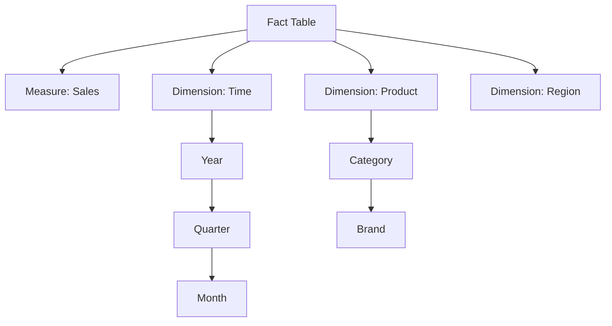

## **OLAP Cube**

---

### **What is an OLAP Cube?**

An **OLAP cube** (also known as a **multidimensional cube**) is a data structure used by OLAP systems to enable **fast, interactive analysis** of data along **multiple dimensions**.

---

### **Purpose**

* Pre-aggregates data to provide **high-speed querying**.
* Enables slicing and dicing of data across **dimensions and hierarchies**.
* Forms the **core structure** for multidimensional analysis.

---

### **Core Components of OLAP Cube**

| Component       | Description                                                              |
| --------------- | ------------------------------------------------------------------------ |
| **Measure**     | Quantitative data (e.g., Sales, Profit, Quantity)                        |
| **Dimension**   | Categorical perspective for analysis (e.g., Time, Product, Region)       |
| **Hierarchy**   | Levels of data granularity in a dimension (e.g., Year → Quarter → Month) |
| **Level**       | A node within a hierarchy (e.g., Month)                                  |
| **Fact Table**  | Central table with numeric measures and foreign keys to dimensions       |
| **Aggregation** | Precomputed summaries for faster query performance                       |

---

### **Structure**

A cube is conceptually an **n-dimensional matrix**:

* Each axis = a **dimension**
* Each cell = a **measure value** at specific dimension values

**Example**: A 3D cube with dimensions:
`Time × Product × Region`
Each cell holds a measure like `Total Sales`.

---

### **OLAP Cube Operations**

| Operation      | Description                                                                        |
| -------------- | ---------------------------------------------------------------------------------- |
| **Slice**      | Select a single value for one dimension (e.g., Year = 2024)                        |
| **Dice**       | Select specific values across multiple dimensions (e.g., Jan & Feb, Product A & B) |
| **Drill-down** | Navigate from summary to detail (e.g., Quarter → Month)                            |
| **Roll-up**    | Aggregate from detail to summary (e.g., Day → Month)                               |
| **Pivot**      | Rotate cube axes for different views (e.g., switch rows/columns)                   |

---

### **OLAP Cube Types**

| Type           | Description                                                                    |
| -------------- | ------------------------------------------------------------------------------ |
| **MOLAP Cube** | Stored in a proprietary multidimensional format                                |
| **ROLAP Cube** | Constructed from relational tables; queries run in real time                   |
| **HOLAP Cube** | Combines MOLAP and ROLAP; summaries pre-aggregated, details from relational DB |

---

### **Advantages**

* **High performance** for complex queries
* **Multidimensional insight** from pre-aggregated data
* Reduces query **response time**
* **User-friendly** for business analysts via drag-and-drop tools

---

### **Disadvantages**

* Can consume **high storage** (especially MOLAP)
* Cube **rebuild needed** after ETL loads
* Complex to design for **very high-dimensional data**

---

### **Mermaid Diagram of Cube Concept**

---
