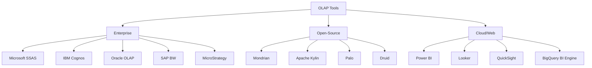

## **OLAP Tools**

---

### **What Are OLAP Tools?**

**OLAP tools** are software systems that support **multidimensional analysis** of data from data warehouses or data marts. These tools help users perform **OLAP operations** (slice, dice, drill-down, roll-up, pivot) to gain business insights efficiently.

They can support different **OLAP types** like MOLAP, ROLAP, HOLAP, etc.

---

### **Popular OLAP Tools by Type**

| Tool Name                | OLAP Type(s)                           | Description                                                                    |
| ------------------------ | -------------------------------------- | ------------------------------------------------------------------------------ |
| **Microsoft SSAS**       | MOLAP, ROLAP, HOLAP                    | Part of Microsoft SQL Server BI stack; highly integrated with Excel & Power BI |
| **IBM Cognos Analytics** | MOLAP                                  | Business intelligence suite with strong cube support                           |
| **Oracle OLAP**          | ROLAP, MOLAP                           | Part of Oracle Database; supports multidimensional queries using SQL           |
| **SAP BW/4HANA**         | HOLAP                                  | SAP's data warehousing and OLAP engine, integrated with HANA                   |
| **MicroStrategy**        | ROLAP                                  | Strong ROLAP support with flexible schema modeling                             |
| **Pentaho Mondrian**     | ROLAP                                  | Open-source OLAP engine used with Pentaho BI suite                             |
| **Tableau**              | Client-side (connects to OLAP sources) | Visual analytics platform; connects to OLAP cubes like SSAS                    |
| **Power BI**             | Client-side + DirectQuery              | Can connect to OLAP cubes (SSAS Tabular), supports slicing & pivoting          |
| **TIBCO Spotfire**       | Hybrid/ROLAP                           | Data visualization & analytics with drill-down and slice capabilities          |
| **Jedox**                | MOLAP                                  | Planning and analytics platform using its own in-memory OLAP engine            |
| **Qlik Sense**           | Hybrid                                 | Associative analytics engine, supports multidimensional modeling               |
| **Dundas BI**            | Hybrid                                 | Dashboarding tool with drill-down and cube capabilities                        |
| **KNIME**                | ROLAP                                  | Open-source analytics platform, supports OLAP via extensions                   |
| **Apache Kylin**         | MOLAP (Big Data)                       | Distributed OLAP engine on Hadoop/Spark, supports huge cubes                   |

---

### **Key Features of OLAP Tools**

| Feature                   | Description                                     |
| ------------------------- | ----------------------------------------------- |
| **Cube Design**           | Define dimensions, hierarchies, and measures    |
| **Drill Capabilities**    | Move between data granularity levels            |
| **Pivoting and Slicing**  | View data from multiple angles                  |
| **Integration**           | Connects with DBs, Excel, dashboards, ETL tools |
| **Security**              | Role-based access and data-level permissions    |
| **Caching & Aggregation** | Improves performance with precomputed summaries |
| **Real-time support**     | Some tools offer real-time OLAP (RTOLAP)        |

---

### **Open-Source OLAP Tools**

| Tool Name        | Description                                     |
| ---------------- | ----------------------------------------------- |
| **Mondrian**     | ROLAP engine by Pentaho, integrates with MDX    |
| **Apache Kylin** | MOLAP engine for big data OLAP on Hadoop/Spark  |
| **Palo/Jedox**   | In-memory MOLAP engine, supports planning       |
| **ClickHouse**   | Fast OLAP database for large-scale analytics    |
| **Druid**        | Real-time OLAP engine optimized for time-series |

---

### **Web-Based/Cloud OLAP Tools**

| Tool                                  | Description                                    |
| ------------------------------------- | ---------------------------------------------- |
| **Google BigQuery BI Engine**         | Fast, in-memory analysis over large datasets   |
| **Amazon QuickSight**                 | OLAP-style dashboards over AWS data            |
| **Microsoft Azure Analysis Services** | Cloud OLAP modeling with SSAS                  |
| **Looker (Google Cloud)**             | Semantic modeling with drill and pivot support |
| **Datapine, Zoho Analytics**          | Modern OLAP dashboards with web access         |

---

### **Mermaid Map of OLAP Tools**

---
