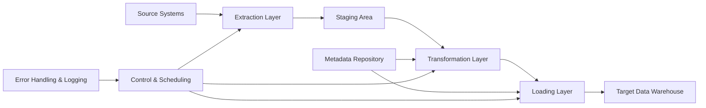

## **ETL Architecture**

---

### **1. What is ETL Architecture?**

ETL Architecture defines the **framework and structure** of the ETL process, detailing how data moves from **source systems** through extraction, transformation, and loading, into the **target data warehouse** or repository.

---

### **2. Key Layers of ETL Architecture**

| Layer                            | Purpose                                                                                    |
| -------------------------------- | ------------------------------------------------------------------------------------------ |
| **Data Source Layer**            | Origin of data—databases, files, APIs, external systems, cloud apps                        |
| **Extraction Layer**             | Connects to sources and extracts raw data, ensuring minimal impact on source systems       |
| **Staging Layer**                | Temporary storage holding raw data before processing, isolating source from transformation |
| **Transformation Layer**         | Applies data cleansing, enrichment, business rules, formatting, and aggregation            |
| **Loading Layer**                | Loads transformed data into target system, managing inserts, updates, and merges           |
| **Metadata Layer**               | Stores technical and business metadata—data lineage, mappings, transformation rules        |
| **Control and Scheduling Layer** | Orchestrates ETL job execution, scheduling, dependency management, error handling          |
| **Target Data Layer**            | Final data repository—data warehouse, data mart, or data lake for analysis and reporting   |

---

### **3. ETL Architectural Components**

* **Source Systems**
  Various heterogeneous systems producing data.

* **Extraction Subsystem**
  Tools/connectors that fetch data (full or incremental).

* **Staging Area**
  Intermediate storage to hold raw extracted data temporarily.

* **Transformation Engine**
  Processes data with business logic, data cleaning, integration, and calculations.

* **Loading Mechanism**
  Writes transformed data into the target system efficiently.

* **Metadata Repository**
  Maintains information about data definitions, transformations, schedules, and audit trails.

* **Job Scheduler and Control System**
  Manages ETL workflows, job dependencies, retries, and notifications.

* **Error Handling and Logging**
  Captures processing errors, logs execution details, and supports debugging.

---

### **4. Typical ETL Data Flow**

---

### **5. ETL Architecture Types**

| Type                | Description                                                            |
| ------------------- | ---------------------------------------------------------------------- |
| **Batch ETL**       | Data extracted and processed in scheduled batches (e.g., nightly)      |
| **Real-time ETL**   | Continuous extraction and loading for near real-time data availability |
| **Hybrid ETL**      | Combination of batch and real-time processes for flexibility           |
| **Cloud-based ETL** | ETL process hosted and managed in the cloud for scalability            |

---

### **6. Key Considerations**

* **Scalability:** Ability to handle growing data volumes.
* **Fault Tolerance:** Recovery and restart on failures.
* **Performance:** Minimize source impact and reduce load times.
* **Maintainability:** Clear metadata and modular design.
* **Security:** Protect data in transit and at rest.

---

### **7. Summary**

ETL architecture provides the **blueprint** for building a robust, efficient, and scalable data integration system by organizing components and workflows to transform raw data into valuable business insights.

---
